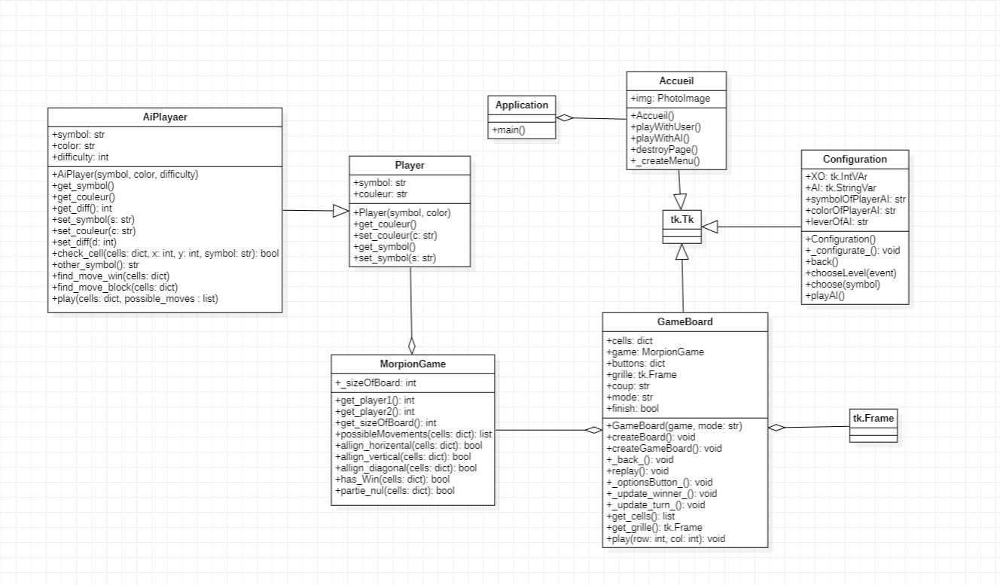

# Jeu de Morpion

## Binome
- ZEGGANE Yathmas
- EL FAKHOURI Yasser

## Rapport
- [Rapport du jeu de morpion](./Projet%20Jeu%20de%20Morpion.pdf)

## Lancement du jeu
-   Depuis le dossier src du projet :
    - `make`  
    Ou : 
    - `cd src` puis `python3 Application.py`

## Diagramme UML
- 

## Développement du projet

- Cahier des charges  :  Fait
- Plan de tests  :  Fait
- Conception  :  Fait
    - Structures de données
    - Architecture du programme
    - Algorithmes
    - Manuel de l'interface
- Problèmes rencontrés  :  Fait
- Points à améliorer  :  Fait

## Cahier des charges  

- Ce jeu se déroule soit entre 2 utilisateurs soit entre un utilisateur et l’IA, et consiste à aligner trois (croix / ronds) sur une matrice composée de 9 cases répartis 3X3 dans des cellules qui forment une grille.
Il existe trois types d'alignements gagnants :   
     alignement vertical.  
     alignement horizontal.  
     alignement diagonal.  
- L'interface utilisateur du jeu de morpion est développée en utilisant la bibliothèque Tkinter de Python. Elle est organisée en plusieurs éléments graphiques :   
Une fenêtre principale affichant la page d’accueil avec 3 boutons   
Partie rapide : Une partie entre deux utilisateurs.  
Configurer AI : Une partie entre un utilisateur et l’AI en personnalisant le niveau, le symbole et la couleur de l’AI.  
- Quitter : Quitter le jeu    

> Le gagnant de la partie est le premier joueur qui parvient à réaliser le premier alignement correct.

## Plans de tests : 
- Avant de lancer le jeu, plusieurs tests unitaires et d’intégration doivent être effectués pour s'assurer que tout fonctionne correctement.   
Les tests unitaires ont pour but de tester chaque unité de code individuellement, c'est-à-dire chaque fonction ou méthode. Pour cela, on utilise Doctest et la méthode testmod() pour exécuter automatiquement les tests écrits dans la documentation de chaque fonction.  
Les tests d'intégration, quant à eux, permettent de tester le fonctionnement des différentes parties du programme ensemble. On a utilisé la bibliothèque Pytest pour écrire et exécuter des tests d'intégration dans un script qui représente un scénario de jeu qui comprend la vérification de la partie nulle, la partie avec un gagnant ainsi que les fonctions utilisées pour réaliser ces fonctionnalités.     
> Voici un exemple de fonction qui vérifie si la partie nulle :

- Ces tests comprennent :  
    - Vérifier que les symboles 'X' et 'O' sont correctement attribués aux joueurs.  
    - Vérifier que le choix de difficulté de l'AI fonctionne correctement.
    - Vérifier que les alignements gagnants sont correctement détectés.
    - Vérifier que le jeu peut détecter une partie nulle correctement.
    - Vérifier que le message de fin de partie s'affiche correctement.

## Conception :
- Dans cette section, on définit l'architecture du programme, les algorithmes utilisés, ainsi que les différents composants du jeu en incluant des captures d'écran de l'interface utilisateur, des diagrammes de classes. Pour chaque composant, son rôle et son fonctionnement, ainsi que les interactions avec les autres composants seront expliqués. 
- Structures de données : 
    - Listes : 
    possibleMovements : une liste qui représente les mouvements possibles des 2 utilisateurs, le mouvement est possible lorsque la case est vide, elle ne contient ni 'X' ni 'O'.
    - Dictionnaire : 
- Dans la classe *GameBoard*, on retrouve deux dictionnaires:
   - cells qui a pour clé est les coordonnées de la cellule, et pour valeur valeur le coup joué : *X* ou *O*.
    - Buttons qui a pour clé est les coordonnées du bouton, et pour valeur valeur le bouton lui-même.
	
- Architecture du programme: 
    - Le programme est écrit en Python. Il utilise la bibliothèque graphique Tkinter pour l'interface utilisateur. Le programme est divisé en plusieurs fonctions:
    - La fonction play qui gère le déroulement du jeu (un clic de l’utilisateur sur un bouton). 
    - La fonction possibleMovements qui vérifie si le mouvement est possible en consultant les cellules et vérifiant si elle est vide ou pas.
    allign_horizental qui vérifie si un alignement horizental gagnant a été réalisé, de même pour allign_vertical et allign_diagonal.
    - La fonction tied_game qui vérifie si la partie est nulle.
    - La fonction has_Win qui vérifie si la partie est nulle.
    - La fonction playAI fait jouer l’AI.

## Algorithmes : 
- L’algorithme utilisé pour l'A propose trois niveau de difficultés, le premier est le :   
> Easy : L’AI choisit une cellule aléatoire parmi celles disponible dans la liste possible_movements, après que l’utilisateur a joué.  
> Medium: L’AI utilise dans ce niveau deux fonctions qui sont : find_move_win qui l’aide à trouver la cellule gagnante si elle existe sinon elle fait appel à  find_move_block qui permet d'empêcher l’utilisateur de gagner. Sinon, une cellule aléatoire est choisie.  
> Hard : L’AI utilise initialement un tableau coins_du_board qui contient les quatres coins de la grille du jeu, puis elle cherche si la cellule au milieu de la grille si elle est libre, si c’est le cas elle la choisit et ensuite elle bascule le niveau de difficulté à 1 car on dispose déjà des fonctions qui font le travail : find_move_win et find_move_block. Sinon si la cellule du milieu est occupée, elle cherche une cellule aléatoire parmi celles dans coins_du_board. Une fois l’AI joué sa première fois, le coup augmente de 1, au prochain tour elle bascule au niveau médium .Cette fois-ci l'AI a accès à une autre condition qui lui permet de choisir un mouvement qui diffère de ceux dans coins_du_board.  
- Manuel de l'interface :  
- Dans cette section, vous pouvez décrire les différentes fonctionnalités de l'interface utilisateur, ainsi que les instructions pour les utiliser. Vous pouvez également inclure des captures d'écran pour illustrer les différentes étapes. Pour chaque fonctionnalité, vous pouvez expliquer comment elle fonctionne, les paramètres éventuels à configurer, ainsi que les messages d'erreur qui peuvent être affichés en cas de problème. 
Bouton "Partie rapide"   
Cette fonctionnalité permet de jouer rapidement à une partie de morpion contre un autre utilisateur.  
Pour jouer une partie rapide, cliquez sur le bouton "Partie rapide".  
Vous serez redirigé vers la page de jeu, où vous pourrez jouer en utilisant les boutons de la grille.  
Vous pouvez également cliquer sur le bouton "Rejouer" pour jouer une nouvelle partie rapide.  
Si un problème survient lors de l'exécution de cette fonctionnalité, un message d'erreur s'affiche pour vous informer de la nature du problème.  
Bouton "Configurer AI" 
Cette fonctionnalité permet de configurer les paramètres de l'ordinateur contre lequel vous jouez.  
Pour configurer l'AI, cliquez sur le bouton "Configurer AI".  
Vous serez redirigé vers la page de configuration de l'AI, où vous pourrez ajuster les paramètres tels que la difficulté de l'AI et son symbole.  
Une fois que vous avez terminé de configurer l'AI, vous pouvez cliquer sur le bouton "play" pour enregistrer vos modifications et ensuite jouer.  
Bouton "Quitter"
Cette fonctionnalité permet de quitter le jeu de morpion.
Pour quitter le jeu, cliquez sur le bouton "Quitter".

## Détails
- Les détails des parties ci-dessus sont expliqués dans le rapport.

